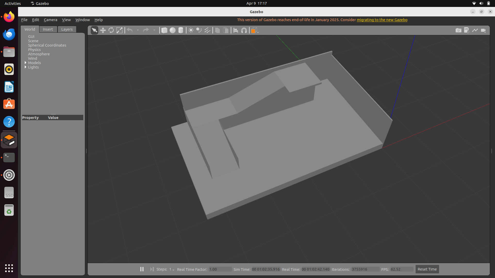
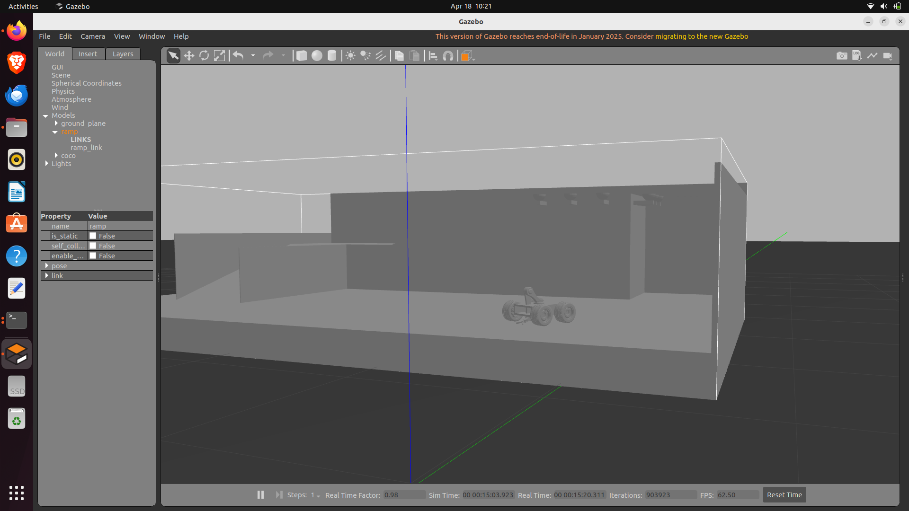
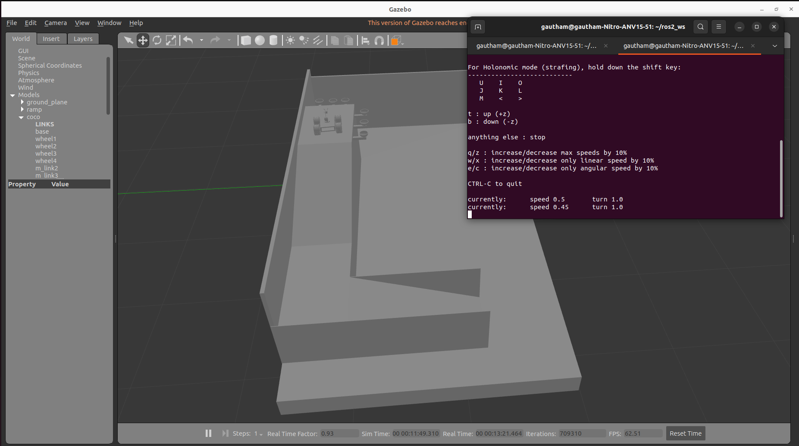
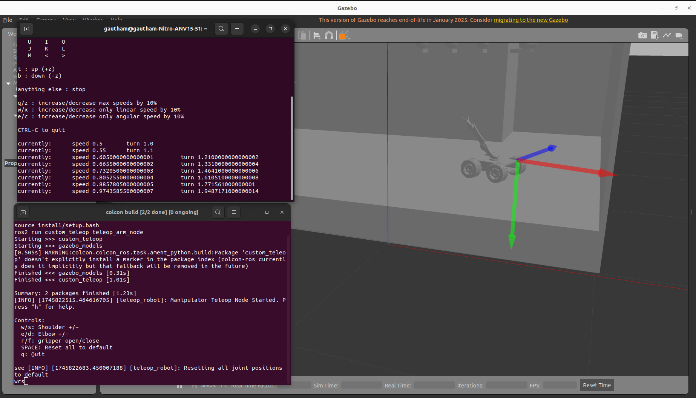

# 🤖 Coco Robot — ROS 2 Gazebo Simulation

A ROS 2 (Humble) simulation of **Coco**, a four-wheel differential-drive mobile robot with a 3-DOF manipulator arm and a 2-finger gripper, designed to traverse a custom ramp platform in Gazebo Classic.

---

## 📸 Screenshots

### Ramp Platform


### Robot on Ramp


### Wheel Base Teleoperation


### Arm Teleoperation


---

## 🗂️ Repository Structure

```
ros2_ws/src/
├── gazebo_models/                      # Robot + environment package
│   ├── launch/
│   │   ├── full_world_robo.launch.py   ← MAIN launch file (use this)
│   │   ├── full_world.launch.py        ← Gazebo world only (no controllers)
│   │   ├── rsp.launch.py               ← robot_state_publisher only (RViz)
│   │   ├── spawn_robot.launch.py       ← Spawn robot into existing Gazebo
│   │   └── spawn_ramp.launch.py        ← Spawn ramp into existing Gazebo
│   ├── meshes/                         ← STL mesh files (robot + ramp)
│   └── urdf/
│       ├── coco_robo2.urdf             ← Main robot URDF
│       ├── abs.urdf                    ← Ramp platform URDF
│       └── coco_arm_controller.yaml    ← ros2_control config
│
└── custom_teleop/                      ← Keyboard teleoperation package
    ├── custom_teleop/
    │   ├── teleop_arm_node.py          ← Arm teleop (w/s/e/d/r/f)
    │   └── teleop_wheels_node.py       ← Wheel teleop (w/a/s/d)
    └── launch/
        └── teleop.launch.py
```

---

## 🤖 Robot Overview

| Feature | Detail |
|---|---|
| ROS Version | ROS 2 Humble |
| Simulator | Gazebo Classic (Gazebo 11) |
| Drive type | Differential drive — two `gazebo_ros_diff_drive` plugins (front + rear axle) |
| Arm | 3-DOF manipulator with 2-finger gripper |
| Arm control | `ros2_control` — `ForwardCommandController` (position mode) |
| Wheel control | `geometry_msgs/Twist` on `/cmd_vel` |

---

## ⚙️ Prerequisites

```bash
sudo apt update && sudo apt install -y \
  ros-humble-gazebo-ros-pkgs \
  ros-humble-gazebo-ros2-control \
  ros-humble-ros2-control \
  ros-humble-ros2-controllers \
  ros-humble-robot-state-publisher
```

---

## 🚀 Installation

```bash
# 1. Clone into your ROS 2 workspace
cd ~/ros2_ws/src
git clone <your-repo-url>

# 2. Install dependencies
cd ~/ros2_ws
rosdep install --from-paths src --ignore-src -r -y

# 3. Build
colcon build --symlink-install

# 4. Source
source ~/ros2_ws/install/setup.bash
```

---

## ▶️ Running the Simulation

```bash
ros2 launch gazebo_models full_world_robo.launch.py
```

Optional:
```bash
# Headless mode (no GUI)
ros2 launch gazebo_models full_world_robo.launch.py gui:=false
```

Wait ~10 seconds for Gazebo to load and all controllers to activate. You should see:
```
[INFO] Configured and activated m_link1_controller
[INFO] Configured and activated m_link2_controller
[INFO] Configured and activated m_link3_controller
[INFO] Configured and activated m_link3_Revolute_9_controller
[INFO] Configured and activated joint_state_broadcaster
```

---

## 🎮 Teleoperation

Open a **new terminal** after the simulation is running:

```bash
source ~/ros2_ws/install/setup.bash

# Arm control
ros2 run custom_teleop teleop_arm_node

# Wheel control (separate terminal)
ros2 run custom_teleop teleop_wheels_node
```

### Arm Controls
| Key | Action |
|---|---|
| `w` / `s` | Shoulder joint +/- |
| `e` / `d` | Elbow joint +/- |
| `r` / `f` | Gripper open / close |
| `SPACE` | Reset to home position |
| `h` | Help |
| `q` | Quit |

### Wheel Controls
| Key | Action |
|---|---|
| `w` | Forward |
| `s` | Backward |
| `a` | Turn left |
| `d` | Turn right |
| `x` | Full stop |
| `q` | Quit |

---

## 📡 ROS 2 Topics

| Topic | Type | Description |
|---|---|---|
| `/cmd_vel` | `geometry_msgs/Twist` | Wheel velocity commands |
| `/m_link1_controller/commands` | `std_msgs/Float64MultiArray` | Shoulder joint |
| `/m_link2_controller/commands` | `std_msgs/Float64MultiArray` | Elbow joint |
| `/m_link3_controller/commands` | `std_msgs/Float64MultiArray` | Gripper finger 1 |
| `/m_link3_Revolute_9_controller/commands` | `std_msgs/Float64MultiArray` | Gripper finger 2 |
| `/joint_states` | `sensor_msgs/JointState` | All joint feedback |
| `/odom` | `nav_msgs/Odometry` | Wheel odometry |
| `/robot_description` | `std_msgs/String` | URDF |

---

## 🛠️ Known Limitations

- The URDF uses plain format (not Xacro), so mesh paths and controller yaml paths are resolved at launch time via the launch file.
- Wheel joints are `continuous` type and are not registered in `ros2_control` — odometry is handled entirely by the Gazebo diff-drive plugin.
- RViz2 config not included yet — use `ros2 launch gazebo_models rsp.launch.py` with a manual RViz session for visualisation.

---

## 📄 License

Apache 2.0 — see [LICENSE](LICENSE)
